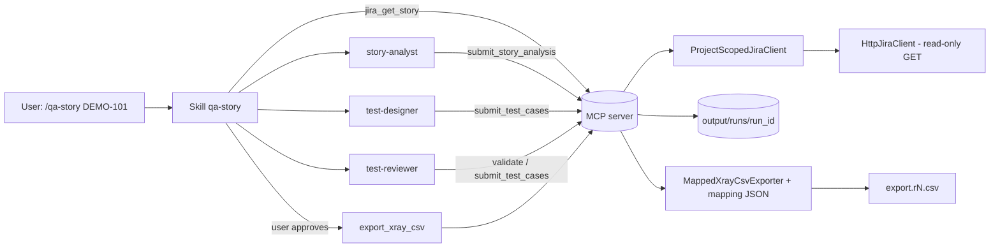

# Architecture overview

## Responsibilities

| Layer | Owns | Must not |
|---|---|---|
| Claude Code skills | Workflow orchestration, user checkpoints | Write CSV, bypass validation |
| Claude Code agents | Story analysis, risk identification, test design, review | Call write tools outside their role |
| MCP server (`mcp/`) | Tool contract, error mapping | Contain business logic or LLM reasoning |
| Services (`services/`) | Use cases: submit, validate, export | Talk to LLMs |
| Adapters (`jira/`, `xray/`, `storage/`) | Jira reads, CSV rendering, run store | Accept unvalidated input |
| Deterministic logic (`analysis/`, `testdesign/`) | Reference checks, coverage, rules | Judge prose quality (that is the reviewer's job) |
| Domain (`domain/`) | Pydantic models and invariants | Do I/O |

Imports only flow downward: `mcp -> services -> adapters/logic -> domain`.

## Data flow



## Run store

```
output/runs/<run_id>/
  manifest.json            run id, story key, latest revision
  analysis.json            StoryAnalysis
  test_cases.r<N>.json     TestCaseSet revision N (each submit = full new revision)
  export.r<N>.csv          deterministic CSV for revision N
```

Export reads `test_cases.r<N>.json` from disk and re-validates it. It never takes test-case
content from the model. Validation reports are not stored: they are recomputed on demand
(`submit_test_cases`, `validate_test_cases`, export), so they can't go stale. Agents read a run
through the sectioned read tools (`get_run`, `get_story_analysis`, `list_test_cases`,
`get_test_cases`), never through file paths.

## Validation layers

1. **Schema** (Pydantic, `extra="forbid"`): types, required fields, id formats, no unknown
   fields.
2. **Deterministic rules** (`testdesign/rules.py`): coverage, references, duplicates, vague
   expected results, untested high risks. Errors block export.
3. **LLM review** (`test-reviewer` agent): advisory. Changes go through `submit_test_cases`
   again.
